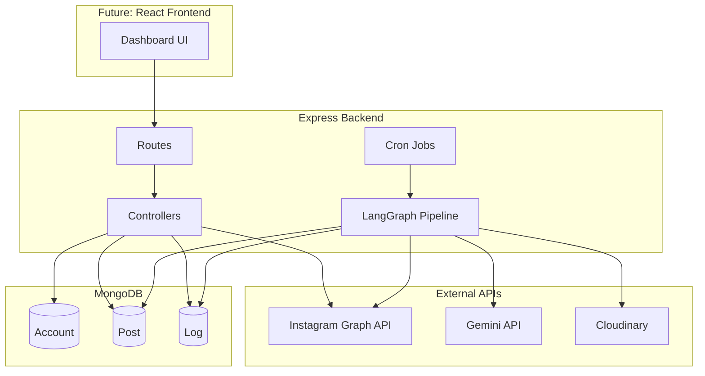
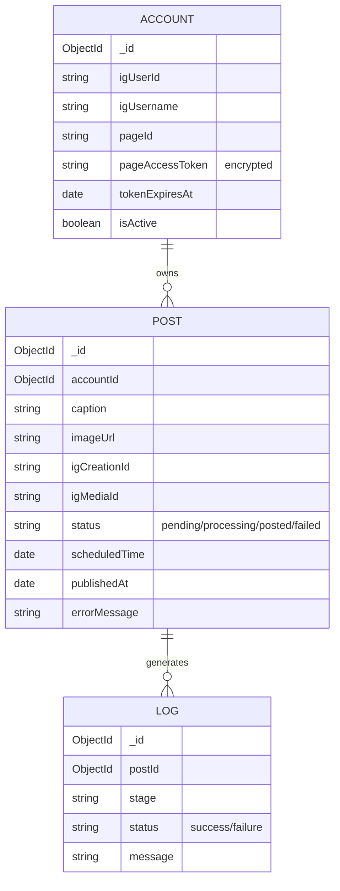
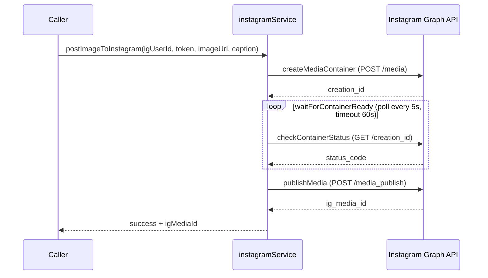
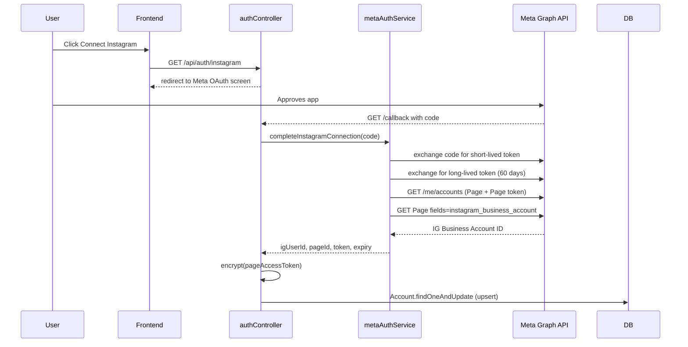
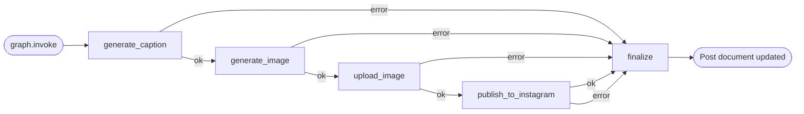
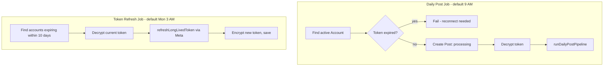
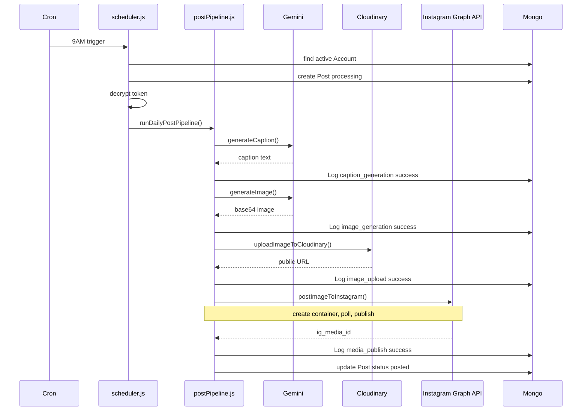

# AI Multi-Platform Auto-Poster — Architecture & Build Roadmap (v2)

This replaces the old single-image, Instagram-only, MongoDB-based project. Nothing here assumes anything from the old markdown files — this is the current, correct plan based on what you actually want:

> A server that, on its own schedule, generates a short AI video (script + voice + visuals, or a native AI video model), then posts that same video to **YouTube Shorts**, **Instagram Reels**, and **Facebook Reels** — fully automated, no database.

---

## 0. What Changed vs the Old Project

| Old (v1)                               | New (v2)                                                                        |
| -------------------------------------- | ------------------------------------------------------------------------------- |
| Static AI image + caption              | Full short-form**AI video** + caption                                     |
| Instagram only                         | Instagram**+ Facebook + YouTube Shorts**                                  |
| MongoDB (Account/Post/Log collections) | **No database** — stateless server, local log files only                 |
| Gemini (text) + Pollinations (image)   | Gemini (script/caption) + a video-generation stage (see §2)                    |
| Cloudinary (image hosting)             | Cloudinary or local storage (video hosting — still required, explained in §6) |

---

## 1. One-Sentence Summary

Every day, a cron job runs a pipeline: **Gemini writes a script + caption → a video is generated from that script → the video is hosted at a public URL → the same video is published to YouTube, Instagram, and Facebook in parallel**, with results written to a local log file instead of a database.

---

## 2. The Video Generation Question (decide this first — it drives everything else)

There are two real options. You need to pick one before Phase 1 starts.

### Option A — Native AI video generation (Veo, via your Gemini API key)

Google's `generateVideos` endpoint (Veo 2/3) can generate a short video directly from a text prompt, no image/voice assembly needed.

- **Pros:** simplest pipeline, genuinely "AI generates the whole video"
- **Cons:** Veo access is billed separately from normal Gemini text calls and is not available on every Gemini API key/tier — needs to be verified in Google AI Studio / Cloud Console before relying on it. Generation is slower (can take 1-3+ minutes per video) and has daily quota caps.
- **Verify first:** log into [Google AI Studio](https://aistudio.google.com) with the same account as your Gemini Pro key and check whether Veo is enabled for that project.

### Option B — Assembled video (recommended default, more reliable)

Gemini writes a script → free/no-key TTS turns it into narration audio → Pollinations/Gemini generates a few still images per script → `ffmpeg` stitches images (Ken Burns zoom/pan) + narration + captions + background music into one MP4.

- **Pros:** no extra billing surprises, fully controllable, works today with what you already have (Gemini + Pollinations), fast (seconds, not minutes)
- **Cons:** it's a "slideshow-style" video, not a native AI-generated video clip

**Recommendation:** Build Option B first since it's guaranteed to work end-to-end with your current keys. Keep the video-generation stage as its own isolated module (`services/videoService.js`) so you can swap it for Option A later without touching the publishing side at all.

---

## 3. High-Level Architecture

```
                ┌─────────────────────┐
                │   node-cron (daily)  │
                └──────────┬───────────┘
                           │ trigger
                           ▼
                ┌─────────────────────┐
                │   Pipeline Runner    │   (no DB — plain async function)
                └──────────┬───────────┘
                           │
      ┌────────────────────┼────────────────────┐
      ▼                    ▼                    ▼
 ┌──────────┐       ┌─────────────┐      ┌──────────────┐
 │ Gemini   │  -->  │ Video Gen    │ -->  │ Video Hosting │
 │ script + │       │ (Option A/B) │      │ (public URL)  │
 │ caption  │       └─────────────┘      └──────┬────────┘
 └──────────┘                                   │
                           ┌─────────────────────┼─────────────────────┐
                           ▼                     ▼                     ▼
                   ┌───────────────┐   ┌──────────────────┐  ┌──────────────────┐
                   │ YouTube Shorts │   │ Instagram Reels   │  │ Facebook Reels    │
                   │ Data API v3    │   │ Graph API         │  │ Graph API         │
                   └───────────────┘   └──────────────────┘  └──────────────────┘
                           │                     │                     │
                           └─────────────────────┼─────────────────────┘
                                                  ▼
                                     ┌─────────────────────────┐
                                     │ local log file (.json)   │
                                     │ logs/2026-08-31.json      │
                                     └─────────────────────────┘
```

Everything runs inside **one Node/Express server**. No queue, no worker processes, no database — the daily job is just a function that runs top to bottom and writes a result file at the end.

---

## 4. Publishing to Each Platform (what's actually required)

All three platforms need one shared precondition: **the finished video must be reachable at a public HTTPS URL** before you can publish it (none of them accept raw file uploads from a script directly except YouTube).

### YouTube Shorts

- Uses the **YouTube Data API v3**, `videos.insert`.
- Requires **OAuth2 with a refresh token** (not a simple API key) — you authorize your own channel once, get a refresh token, and store it in `.env`. The server uses that refresh token forever after (until revoked).
- Video must be vertical (1080×1920 or similar), under ~60s, and the title/description should include `#Shorts` to be classified correctly.
- This one **accepts direct file upload** (multipart), so it doesn't strictly need a public URL — only Instagram/Facebook do.

### Instagram Reels

- Uses the **Instagram Graph API** (same app you already set up, Instagram Login based).
- Container creation call needs `media_type=REELS` and a `video_url` pointing at your publicly hosted video.
- Same create-container → poll status → publish flow as before, just with `REELS` instead of image.

### Facebook Reels

- Uses the **Facebook Graph API** on the Page connected to your app (`/{page-id}/video_reels`), with a **Page Access Token** (different from the Instagram user token — you'll generate this from the same Meta app, but it needs the Page added and `pages_manage_posts` + `pages_read_engagement` permissions).
- Also needs the video at a public URL, same as Instagram.

---

## 5. No-Database State Management

You don't need MongoDB for this. Since it's one video per day with no user accounts, no post history UI, and no multi-tenant logic, a database is overhead. Instead:

- Each pipeline run writes a single JSON file: `logs/YYYY-MM-DD.json` containing the script, caption, video path/URL, and the result (success/failure + platform post IDs) for each of the three platforms.
- If a run needs to avoid double-posting on the same day, the server just checks **"does `logs/<today>.json` already exist and contain a success entry?"** before running — one `fs.existsSync` check replaces what Mongo was doing.
- If you later want a dashboard/history UI, these JSON files are trivially readable — you're not locked out of adding a DB later, you just don't need one for v2 to work.

---

## 6. Do You Still Need Cloudinary?

Yes — for Instagram and Facebook specifically, since both require a public video URL, not a file. Two options:

1. **Keep Cloudinary** — upload the finished MP4 there (same as v1's image upload, just `resource_type: "video"`). Simplest, minimal code change from what you had.
2. **Self-host** — serve the `outputs/` folder as static files from your own Express server (`app.use('/media', express.static(...))`) and use `https://your-domain.com/media/video.mp4` as the URL. Only works if your server has a stable public domain (e.g. deployed on Render/Railway with a fixed URL) — free, but ties you to your server's uptime.

**Recommendation:** keep Cloudinary for now (video hosting on the free tier is fine for a few short videos a day) — it's the path of least resistance since you already have the account.

---

## 7. Updated Folder Structure

```
ai-auto-poster/
├── .env
├── package.json
├── src/
│   ├── config/
│   │   ├── gemini.js
│   │   ├── youtube.js          (NEW)
│   │   ├── instagram.js
│   │   ├── facebook.js         (NEW)
│   │   └── cloudinary.js
│   ├── services/
│   │   ├── scriptService.js    (NEW — Gemini script + caption generation)
│   │   ├── videoService.js     (NEW — assembles or generates the video)
│   │   ├── ttsService.js       (NEW — narration audio, if Option B)
│   │   ├── uploadService.js    (video → Cloudinary)
│   │   ├── youtubeService.js   (NEW — videos.insert)
│   │   ├── instagramService.js (updated for REELS)
│   │   └── facebookService.js  (NEW)
│   ├── pipeline/
│   │   └── runDailyVideoPost.js (replaces the old LangGraph pipeline — plain async orchestration is enough here)
│   ├── cron/
│   │   └── scheduler.js
│   ├── routes/
│   │   └── postRoutes.js       (GET /health, POST /run-now)
│   ├── logs/                    (auto-created, gitignored)
│   ├── tmp/                     (auto-created, gitignored — local video assembly workspace)
│   └── server.js
```

No `models/`, no `controllers/` split for DB records, no Mongoose — the pipeline is simple enough to live as one orchestration file that calls services in order.

---

## 8. Updated `.env` (built on top of yours — Mongo removed, YouTube + Facebook added)

```env
# --- Server ---
PORT=5000
NODE_ENV=development

# --- Gemini API (script + caption generation) ---
GEMINI_API_KEY=
GEMINI_TEXT_MODEL=gemini-3.6-flash
# Only needed if you go with Option A (native Veo video generation)
GEMINI_VIDEO_MODEL=veo-3.0-generate-001

# --- Cloudinary (video hosting — required for IG + FB public video_url) ---
CLOUDINARY_CLOUD_NAME=
CLOUDINARY_API_KEY=
CLOUDINARY_API_SECRET=

# --- Instagram (Graph API, Instagram Login — same app as before) ---
INSTAGRAM_APP_ID=
INSTAGRAM_APP_SECRET=
INSTAGRAM_REDIRECT_URI=http://localhost:5000/api/auth/instagram/callback
INSTAGRAM_ACCESS_TOKEN=
INSTAGRAM_USER_ID=

# --- Facebook Page (Graph API — same Meta app, add Page permissions) ---
FACEBOOK_PAGE_ID=
FACEBOOK_PAGE_ACCESS_TOKEN=

# --- YouTube (Data API v3 — separate Google Cloud project, OAuth2) ---
YOUTUBE_CLIENT_ID=
YOUTUBE_CLIENT_SECRET=
YOUTUBE_REDIRECT_URI=http://localhost:5000/api/auth/youtube/callback
YOUTUBE_REFRESH_TOKEN=

# --- TTS (only needed for Option B narration) ---
TTS_PROVIDER=google        # or elevenlabs
ELEVENLABS_API_KEY=

# --- Scheduler ---
DAILY_POST_CRON=0 9 * * *

# --- Manual trigger protection ---
TRIGGER_SECRET=
```

Notes on what was removed from your old `.env`:

- `MONGO_URI` — gone, no DB
- `TOKEN_ENCRYPTION_KEY` — only mattered because tokens were stored in Mongo; if you're not persisting tokens in a DB, long-lived tokens can sit directly in `.env` instead (still keep `.env` out of git)
- `GEMINI_IMAGE_MODEL` — kept implicitly via Pollinations for Option B, or replaced by `GEMINI_VIDEO_MODEL` for Option A

---

## 9. Credential Setup — Step by Step

### 9.1 YouTube Data API (new, not done before)

1. Go to [console.cloud.google.com](https://console.cloud.google.com), create/select a project.
2. Enable **YouTube Data API v3** (APIs & Services → Library → search it → Enable).
3. Go to **APIs & Services → Credentials → Create Credentials → OAuth client ID**.
   - Application type: **Web application**
   - Authorized redirect URI: `http://localhost:5000/api/auth/youtube/callback`
4. Copy the **Client ID** and **Client Secret** into `.env`.
5. Configure the **OAuth consent screen** — add your own Google account as a **Test User** (keeps the app in "Testing" mode, which is fine for personal use, no Google review needed).
6. Run the one-time auth flow (`GET /api/auth/youtube` → approve → `/callback` captures the **refresh token**) — this refresh token goes into `.env` and is reused forever by the server. This is the only manual step; after this, publishing is fully automated.

### 9.2 Facebook Page permissions (extending your existing Meta app)

1. In the same Meta Developer App you already have, go to **App Roles → Roles** and make sure your Facebook account (the one that manages your Page) is added.
2. Add the **Facebook Login** or **Pages API** product if not already present (you'll need `pages_show_list`, `pages_read_engagement`, `pages_manage_posts`, and `publish_video` permissions).
3. Generate a **Page Access Token** for the specific Page (via Graph API Explorer or the standard Page token exchange flow) — this is different from your Instagram user token.
4. For a personal/single-page use case, a **long-lived Page token** (which effectively doesn't expire as long as the Page exists and the app stays active) is enough — no refresh cron needed for this one.

### 9.3 Instagram

- Already set up from before. Only change: containers now use `media_type=REELS` with `video_url` instead of `image_url`.

---

## 10. Phased Build Roadmap

### Phase 0 — Decide & Prep (before writing code)

- [ ] Confirm Option A (Veo) vs Option B (assembled video) — check Veo availability in AI Studio first
- [ ] Confirm `ffmpeg` can be installed on your dev machine and deployment target (needed for Option B)
- [ ] Confirm Cloudinary free tier video limits are enough for daily use

### Phase 1 — Script + Caption Generation

- [ ] `services/scriptService.js`: Gemini call that returns `{ script, caption, hashtags }` from a rotating topic/theme (same day-of-year rotation idea from v1 is fine to reuse)

### Phase 2 — Video Generation

- [ ] If Option B: `services/ttsService.js` (text → narration audio file), then `services/videoService.js` (script + narration + generated images → MP4 via `ffmpeg`, using `fluent-ffmpeg` or raw CLI calls)
- [ ] If Option A: `services/videoService.js` calls Gemini's `generateVideos` (Veo) directly with the script as prompt, polls for completion, downloads the result

### Phase 3 — Hosting

- [ ] `services/uploadService.js`: upload finished MP4 to Cloudinary (`resource_type: "video"`), return public URL

### Phase 4 — Platform Publishers (build and test one at a time, in this order — YouTube first since it's least fragile)

- [ ] `services/youtubeService.js` — `videos.insert` with resumable upload
- [ ] `services/instagramService.js` — update container creation to `REELS` + `video_url`
- [ ] `services/facebookService.js` — `/{page-id}/video_reels` flow

### Phase 5 — Orchestration

- [ ] `pipeline/runDailyVideoPost.js` — calls Phases 1→4 in order, catches errors per-platform (so one platform failing doesn't block the other two), writes the day's result to `logs/YYYY-MM-DD.json`

### Phase 6 — Scheduling & Manual Trigger

- [ ] `cron/scheduler.js` — node-cron using `DAILY_POST_CRON`
- [ ] `POST /api/posts/run-now` — protected by `TRIGGER_SECRET` header, same pattern as before, for manual testing without waiting for the cron

### Phase 7 — End-to-End Test

- [ ] Run `run-now` manually, confirm all three platforms receive the post, check `logs/` output, verify no double-posting on a second manual run same day (if you want that guard)

---

## 11. Quick Install (once Phase 1 starts)

```bash
npm install express dotenv node-cron axios cloudinary googleapis fluent-ffmpeg
```

- `googleapis` — YouTube Data API + OAuth2 client
- `fluent-ffmpeg` — only needed for Option B video assembly (also requires `ffmpeg` installed on the system itself, not just the npm wrapper)
- Everything else matches what you already had, minus `mongoose`, `@langchain/langgraph`, and `zod` (no longer needed without the DB-backed graph state)

---

## 12. Open Decision Before Coding Starts

The one thing this roadmap can't decide for you: **Option A (Veo) or Option B (assembled slideshow-style video)?** Check Veo access in AI Studio first — that answer determines whether Phase 2 is a single API call or a small ffmpeg pipeline. Everything else in this document (publishing, hosting, scheduling, no-DB logging) is identical either wa

# Instagram Login Migration Update

Switched the backend auth layer from the old Facebook Page based Instagram Graph API flow to Instagram Login only.

Why:

- The app no longer depends on a Facebook Page.
- The connected account is now expected to be an Instagram Business or Creator account.

Breaking change:

- Legacy `Account` documents created with `pageId` and `pageAccessToken` are not compatible with the new schema.
- Delete those old account documents from MongoDB and reconnect the account through `GET /api/auth/instagram`.

Files touched in the migration:

- `src/config/instagram.js`
- `src/services/instagramAuthService.js`
- `src/services/instagramService.js`
- `src/controllers/authController.js`
- `src/controllers/tokenController.js`
- `src/models/Account.js`
- `src/cron/scheduler.js`
- `.env`
- `.env.example`

# IG Auto Poster — Backend Documentation

Complete reference of everything built so far: every file, what each function does, and how they connect.

---

## 1. Project Status

```
✅ Backend fully coded
🔲 Meta App setup (your manual part)
🔲 React frontend (not started)
🔲 End-to-end test with real credentials
```

---

## 2. Folder Structure

```
📦src
 ┣ 📂config
 ┃ ┣ 📜cloudinary.js
 ┃ ┣ 📜db.js
 ┃ ┣ 📜gemini.js
 ┃ ┗ 📜meta.js
 ┣ 📂controllers
 ┃ ┣ 📜accountController.js
 ┃ ┣ 📜authController.js
 ┃ ┣ 📜postController.js
 ┃ ┗ 📜tokenController.js
 ┣ 📂cron
 ┃ ┗ 📜scheduler.js
 ┣ 📂graph
 ┃ ┗ 📜postPipeline.js
 ┣ 📂models
 ┃ ┣ 📜Account.js
 ┃ ┣ 📜Log.js
 ┃ ┗ 📜Post.js
 ┣ 📂routes
 ┃ ┣ 📜accountRoutes.js
 ┃ ┣ 📜authRoutes.js
 ┃ ┗ 📜postRoutes.js
 ┣ 📂services
 ┃ ┣ 📜aiService.js
 ┃ ┣ 📜instagramService.js
 ┃ ┣ 📜metaAuthService.js
 ┃ ┗ 📜uploadService.js
 ┣ 📂utils
 ┃ ┗ 📜encryption.js
 ┣ 📜app.js
 ┗ 📜server.js
```

**Layer roles (MVC-style):**

- **`routes/`** — only maps `path → controller function`, zero logic
- **`controllers/`** — request/response handling, calls services, talks to models
- **`services/`** — talks to external APIs (Meta, Gemini, Cloudinary) — no Express, no DB
- **`models/`** — MongoDB schemas (Mongoose)
- **`graph/`** — LangGraph pipeline that orchestrates services in sequence
- **`cron/`** — scheduled jobs that trigger the pipeline / token refresh
- **`utils/`** — standalone helpers (encryption)
- **`config/`** — environment variable loading, grouped by external service

---

## 3. High-Level Architecture



---

## 4. Config Layer (`src/config/`)

Each file loads and validates environment variables for one external service. Nothing else lives here.

| File              | Exports                                                                                                | Purpose                                                                                                                      |
| ----------------- | ------------------------------------------------------------------------------------------------------ | ---------------------------------------------------------------------------------------------------------------------------- |
| `db.js`         | `connectDB()`                                                                                        | Connects Mongoose to`MONGO_URI`. Exits process if connection fails.                                                        |
| `meta.js`       | `GRAPH_API_VERSION`, `GRAPH_BASE_URL`, `META_APP_ID`, `META_APP_SECRET`, `META_REDIRECT_URI` | Central Meta/Instagram Graph API settings. Version is a variable, not hardcoded, since Meta ships new versions periodically. |
| `gemini.js`     | `GEMINI_API_KEY`, `GEMINI_BASE_URL`, `TEXT_MODEL`, `IMAGE_MODEL`                               | Gemini API settings. Model names configurable via`.env`.                                                                   |
| `cloudinary.js` | configured`cloudinary` instance                                                                      | Initializes the Cloudinary SDK with cloud name/API key/secret.                                                               |

---

## 5. Models (`src/models/`)



| File           | Purpose                                                                                                                                                                    |
| -------------- | -------------------------------------------------------------------------------------------------------------------------------------------------------------------------- |
| `Account.js` | One document per connected Instagram Business account. Stores the**encrypted** page access token and its expiry.                                                     |
| `Post.js`    | One document per daily post attempt. Tracks lifecycle:`pending → processing → posted/failed`.                                                                          |
| `Log.js`     | One document per pipeline stage per post (caption_generation, image_generation, image_upload, media_container, media_publish, token_refresh). Used for debugging failures. |

---

## 6. Services (`src/services/`)

Services only talk to external APIs. They never touch Express `req`/`res`, and every function returns `{ success, ...data }` or `{ success: false, error }` — never throws — so callers can handle failures without try/catch everywhere.

### `instagramService.js`



| Function                    | Purpose                                                                                                        |
| --------------------------- | -------------------------------------------------------------------------------------------------------------- |
| `createMediaContainer()`  | Step 1 of publishing — sends image URL + caption, gets back a`creationId`.                                  |
| `checkContainerStatus()`  | Checks if Instagram finished processing the container (`IN_PROGRESS`, `FINISHED`, `ERROR`, `EXPIRED`). |
| `waitForContainerReady()` | Polls status every 5s, times out after 60s.                                                                    |
| `publishMedia()`          | Step 2 — publishes the container live using`creationId`.                                                    |
| `postImageToInstagram()`  | **Main entry point.** Runs all 3 steps in sequence; returns which stage failed if any step breaks.       |

### `aiService.js`

| Function                         | Purpose                                                                                           |
| -------------------------------- | ------------------------------------------------------------------------------------------------- |
| `generateCaption(topicPrompt)` | Calls Gemini text model. Returns caption text. Has a default prompt; accepts a custom topic.      |
| `generateImage(imagePrompt)`   | Calls Gemini image model. Returns base64 image data + mime type —**not yet a public URL**. |

### `uploadService.js`

| Function                                              | Purpose                                                                                                                                                   |
| ----------------------------------------------------- | --------------------------------------------------------------------------------------------------------------------------------------------------------- |
| `uploadImageToCloudinary({ base64Data, mimeType })` | Converts Gemini's base64 image into a Cloudinary data URI, uploads it, returns a public URL + public ID. This URL is what Instagram's API actually needs. |

### `metaAuthService.js`



| Function                                             | Purpose                                                                                                                             |
| ---------------------------------------------------- | ----------------------------------------------------------------------------------------------------------------------------------- |
| `exchangeCodeForShortLivedToken(code)`             | OAuth step 1 — trades the redirect`code` for a short-lived user token.                                                           |
| `exchangeForLongLivedToken(token)`                 | OAuth step 2 — upgrades to a 60-day long-lived token.                                                                              |
| `refreshLongLivedToken(currentToken)`              | Alias of the above, used specifically by the refresh job — re-exchanges a still-valid token for a fresh 60-day one.                |
| `getPages(userAccessToken)`                        | Gets the Facebook Page(s) connected to the user, each with its own Page Access Token.                                               |
| `getInstagramBusinessAccountId(pageId, pageToken)` | Resolves the Instagram Business Account ID linked to a Page.                                                                        |
| `completeInstagramConnection(code)`                | **Main entry point** — runs the full 4-step OAuth chain above and returns everything needed to save an `Account` document. |

---

## 7. Utils (`src/utils/`)

### `encryption.js`

AES-256-GCM encryption for the access token at rest in MongoDB. GCM provides both confidentiality **and** tamper detection (an authentication tag).

| Function                     | Purpose                                                                                                                        |
| ---------------------------- | ------------------------------------------------------------------------------------------------------------------------------ |
| `encrypt(plainText)`       | Encrypts a string, returns`iv:authTag:ciphertext` (all hex) as one string, ready to store in one Mongo field.                |
| `decrypt(encryptedString)` | Reverses it.**Throws** if the key is wrong or the data was tampered with — this is intentional, callers must handle it. |

Requires `TOKEN_ENCRYPTION_KEY` in `.env` — a 64-character hex string (32 bytes). Generate with:

```bash
node -e "console.log(require('crypto').randomBytes(32).toString('hex'))"
```

---

## 8. Controllers (`src/controllers/`)

Controllers hold all the actual logic for each route. Routes just point to these functions.

| File                     | Function                         | Purpose                                                                                                               |
| ------------------------ | -------------------------------- | --------------------------------------------------------------------------------------------------------------------- |
| `authController.js`    | `redirectToInstagramAuth`      | Redirects browser to Meta's OAuth consent screen.                                                                     |
|                          | `handleInstagramCallback`      | Handles the OAuth redirect, calls`metaAuthService`, **encrypts** the token, upserts the `Account` document. |
| `postController.js`    | `runNow`                       | Manually triggers`triggerDailyPost()` from `scheduler.js` immediately.                                            |
|                          | `listPosts`                    | Returns all`Post` documents, newest first.                                                                          |
|                          | `getPostById`                  | Returns one`Post` plus its related `Log` entries.                                                                 |
|                          | `deletePost`                   | Deletes a`Post` record (does not delete the live Instagram post — the API doesn't support that here).              |
| `accountController.js` | `getAccountStatus`             | Returns connection status + token expiry.**Never returns the raw token.**                                       |
| `tokenController.js`   | `refreshAccountToken(account)` | Decrypts current token, calls`refreshLongLivedToken()`, re-encrypts, saves new token + expiry, for one account.     |
|                          | `refreshExpiringTokens()`      | Finds all active accounts within a**10-day refresh window** (not yet expired) and refreshes each.               |

---

## 9. Routes (`src/routes/`)

Thin — each line just maps an HTTP path to a controller function.

| Method | Path                             | Controller Function                         |
| ------ | -------------------------------- | ------------------------------------------- |
| GET    | `/api/auth/instagram`          | `authController.redirectToInstagramAuth`  |
| GET    | `/api/auth/instagram/callback` | `authController.handleInstagramCallback`  |
| POST   | `/api/posts/run-now`           | `postController.runNow`                   |
| GET    | `/api/posts`                   | `postController.listPosts`                |
| GET    | `/api/posts/:id`               | `postController.getPostById`              |
| DELETE | `/api/posts/:id`               | `postController.deletePost`               |
| GET    | `/api/account`                 | `accountController.getAccountStatus`      |
| GET    | `/api/health`                  | inline in`server.js` — basic alive check |

---

## 10. LangGraph Pipeline (`src/graph/postPipeline.js`)

The core automation. Wires `aiService`, `uploadService`, and `instagramService` into one graph with error short-circuiting — if any node fails, execution jumps straight to `finalize` instead of wasting further API calls.



**State schema** — defined with **Zod** (`z.object({...})`), passed into `StateGraph`. Fields: `accountId, igUserId, accessToken, postId, caption, imageBase64, imageMimeType, imageUrl, igMediaId, error, failedStage`.

| Function                                                    | Purpose                                                                                                                                 |
| ----------------------------------------------------------- | --------------------------------------------------------------------------------------------------------------------------------------- |
| `writeLog()`                                              | Writes a`Log` entry per stage. Never throws — a logging failure shouldn't crash the pipeline.                                        |
| `generateCaptionNode()`                                   | Calls`aiService.generateCaption()`.                                                                                                   |
| `generateImageNode()`                                     | Calls`aiService.generateImage()`.                                                                                                     |
| `uploadImageNode()`                                       | Calls`uploadService.uploadImageToCloudinary()`.                                                                                       |
| `publishToInstagramNode()`                                | Calls`instagramService.postImageToInstagram()`.                                                                                       |
| `finalizeNode()`                                          | Updates the`Post` document — `status: "posted"` with `igMediaId`/`publishedAt`, or `status: "failed"` with `errorMessage`. |
| `routeAfter(nextNode)`                                    | Router used after every node — if`state.error` is set, route to `finalize`; otherwise continue to `nextNode`.                    |
| `buildPostingGraph()`                                     | Assembles and compiles the graph (nodes + edges).                                                                                       |
| `runDailyPostPipeline({ postId, igUserId, accessToken })` | **Main entry point**, called by the cron job / manual trigger.                                                                    |

---

## 11. Cron Jobs (`src/cron/scheduler.js`)



| Function                    | Purpose                                                                                                                                                                                                 |
| --------------------------- | ------------------------------------------------------------------------------------------------------------------------------------------------------------------------------------------------------- |
| `triggerDailyPost()`      | Finds the active`Account`, checks token isn't expired, creates a `Post` doc, decrypts the token, runs `runDailyPostPipeline()`. Used by both the cron schedule and the manual `/run-now` route. |
| `startDailyPostCron()`    | Registers`triggerDailyPost()` on a schedule from `DAILY_POST_CRON` (default `0 9 * * *`).                                                                                                         |
| `startTokenRefreshCron()` | Registers`refreshExpiringTokens()` on a schedule from `TOKEN_REFRESH_CRON` (default `0 3 * * 1` — Mondays 3 AM).                                                                                 |

---

## 12. Entry Point (`src/server.js`)

Boot order:

1. Load `.env` (`dotenv`)
2. Connect MongoDB (`connectDB()`)
3. Mount routes (`/api/auth`, `/api/posts`, `/api/account`, `/api/health`)
4. Start listening
5. Start both cron jobs (`startDailyPostCron()`, `startTokenRefreshCron()`)

---

## 13. Complete Request/Automation Flow



---

## 14. Required Environment Variables (`.env`)

```env
# --- Server ---
PORT=5000
NODE_ENV=development

# --- MongoDB ---
MONGO_URI=mongodb://127.0.0.1:27017/ig-auto-poster

# --- Meta / Instagram Graph API ---
META_APP_ID=
META_APP_SECRET=
META_REDIRECT_URI=http://localhost:5000/api/auth/instagram/callback
GRAPH_API_VERSION=v21.0

# --- Token encryption (32-byte hex key) ---
TOKEN_ENCRYPTION_KEY=

# --- Gemini API ---
GEMINI_API_KEY=
GEMINI_TEXT_MODEL=gemini-2.5-flash
GEMINI_IMAGE_MODEL=gemini-2.5-flash-image

# --- Cloudinary ---
CLOUDINARY_CLOUD_NAME=
CLOUDINARY_API_KEY=
CLOUDINARY_API_SECRET=

# --- Scheduler ---
DAILY_POST_CRON=0 9 * * *
TOKEN_REFRESH_CRON=0 3 * * 1
```

---

## 15. What's Left

| Step | Item                                                                                       | Owner             |
| ---- | ------------------------------------------------------------------------------------------ | ----------------- |
| 13   | Create Meta Developer App, convert IG to Business, get App ID/Secret, do a real OAuth test | You               |
| 14   | React frontend — connect button, post history table, logs viewer, manual run-now button   | Build together    |
| 15   | End-to-end test with real credentials                                                      | You, with support |

---

## 16. Quick Install

```bash
npm install
```

Installs: `express`, `mongoose`, `axios`, `cloudinary`, `@langchain/langgraph`, `zod`, `node-cron`, `dotenv`, `cors` (plus `nodemon` as a dev dependency).
